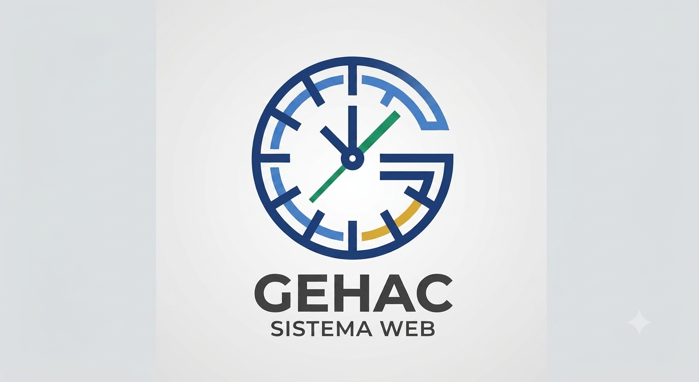
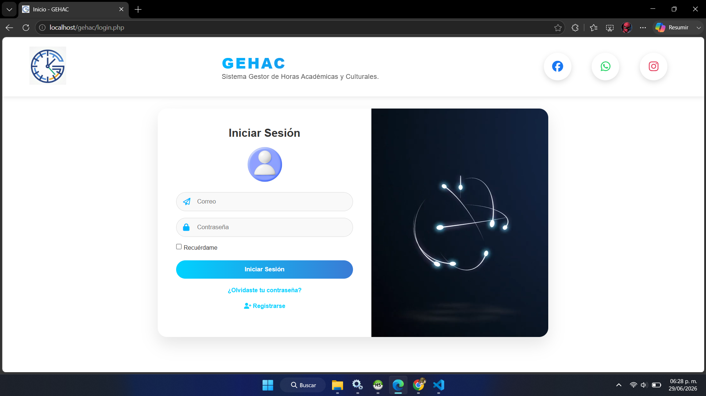
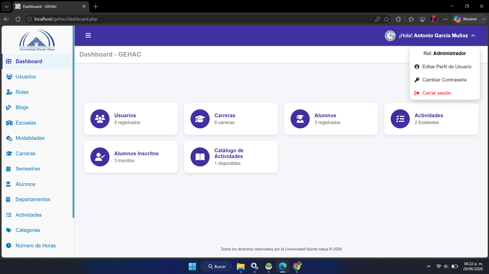
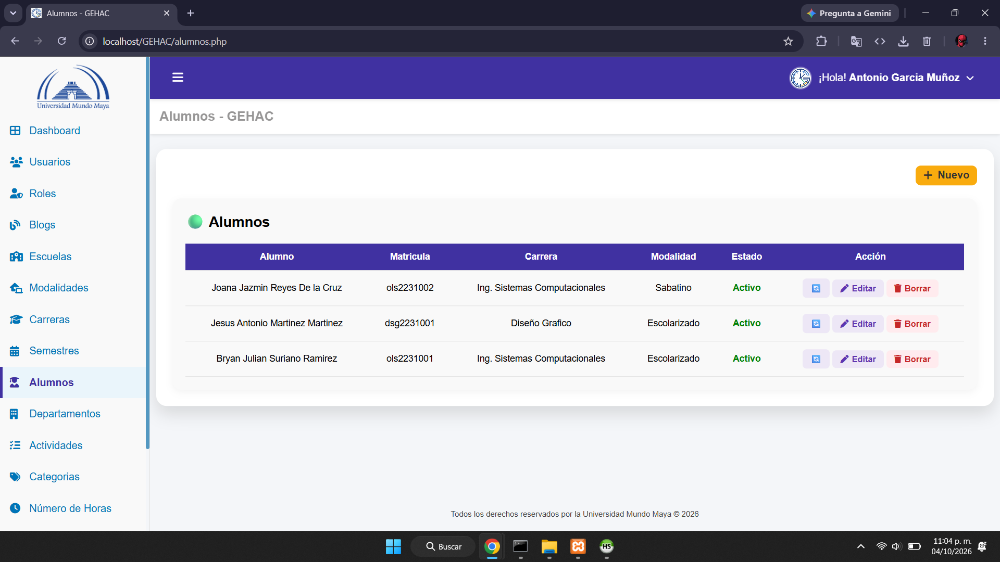
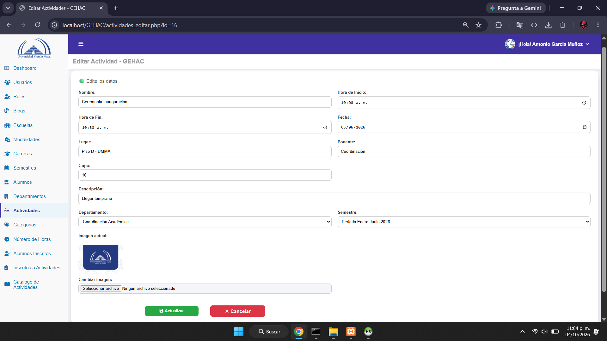
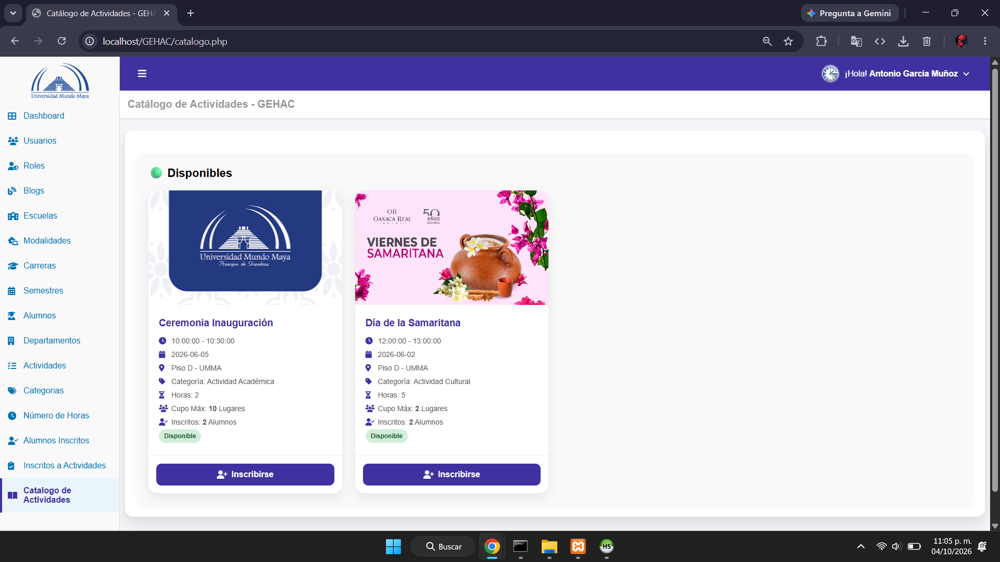
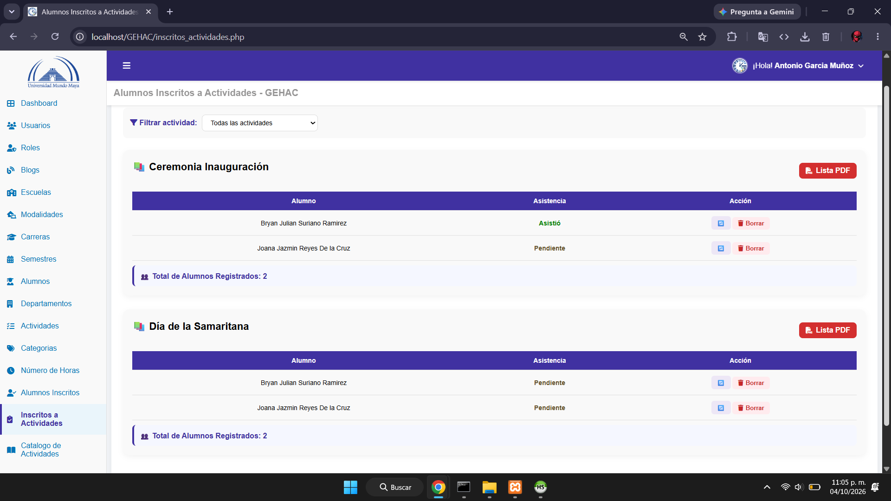
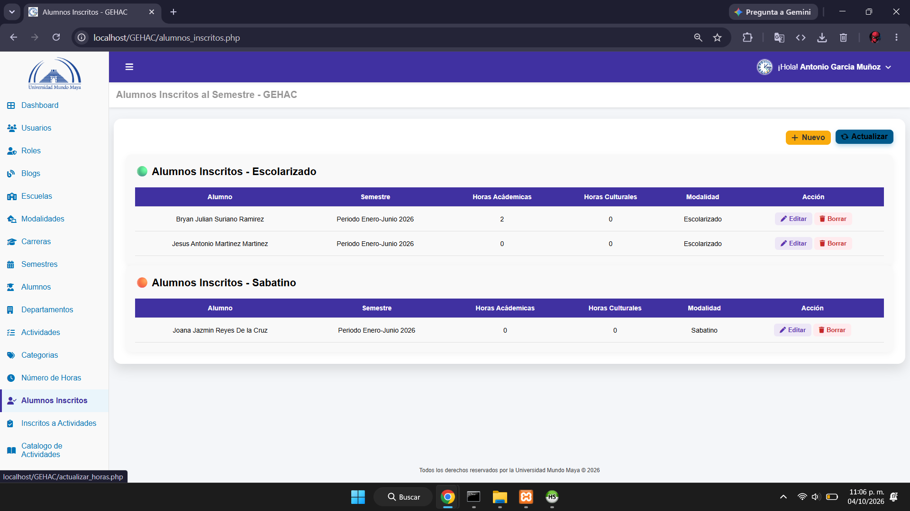
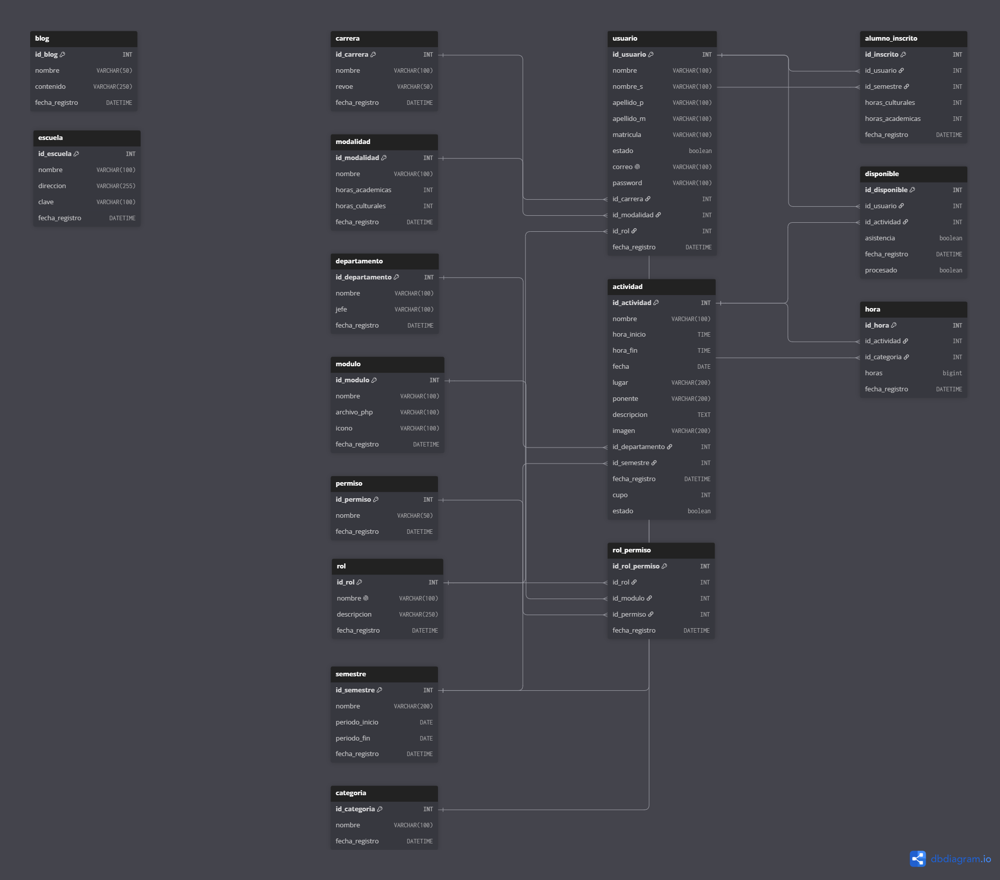

# ⏰ GEHAC



**"Gestor de Horas Académicas y Culturales"**
*Sistema de administración y control de actividades estudiantiles*

🚀 **¡Bienvenido a GEHAC!**
GEHAC es un sistema web desarrollado para gestionar, registrar y controlar las horas académicas y culturales de los alumnos de forma eficiente.

Su objetivo es facilitar el seguimiento de actividades, automatizar el cálculo de horas acumuladas y mejorar la organización institucional.

---

## 🔹 Características

* 📚 Registro de actividades académicas
* 🎭 Registro de actividades culturales
* 👨‍🎓 Gestión de alumnos inscritos
* 📋 Control de asistencias a eventos
* ⏳ Cálculo automático de horas acumuladas
* 📝 Generación de reportes y estadísticas
* 👨‍🏫 Gestión de responsables y administradores
* 📅 Control por semestres
* 🔐 Sistema de autenticación y permisos
* 💻 Interfaz web intuitiva y amigable

---

## 🖼️ Capturas

### Pantalla de inicio de sesión



### Dashboard principal



### Gestión de alumnos



### Registro de actividades




### Reportes y estadísticas




---

## ⚡ Tecnologías utilizadas

* **PHP**
* **MySQL**
* **HTML5**
* **CSS3**
* **JavaScript**
* **Bootstrap**
* **WAMP Server**

---

## 📂 Estructura del proyecto

```bash id="e9jv2n"
GEHAC/
│── bd/                     # Base de datos SQL
│── css/                    # Archivos de estilos
│── js/                     # Scripts JavaScript
│── img/                    # Recursos visuales
│── includes/               # Configuración y utilidades
│── auth.php                # Validación de sesión
│── conexion.php            # Conexión a base de datos
│── index.php               # Inicio de sesión
│── dashboard.php           # Panel principal
│── alumnos.php             # Gestión de alumnos
│── actividades.php         # Gestión de actividades
│── asistencias.php         # Registro de asistencias
│── horas.php               # Cálculo de horas
│── reportes.php            # Reportes generales
│── usuarios.php            # Gestión de usuarios
```

---

### 🛢️ Diagrama E-R de la Base de Datos.



---

## 🚀 Instalación

1. Clona este repositorio:

```bash id="y4o0a1"
git clone https://github.com/tuusuario/GEHAC.git
```

2. Mueve el proyecto a tu carpeta de servidor local:

```bash id="m4r7zd"
wamp64/www/
```

3. Importa la base de datos:

```bash id="v7tk2r"
bd/gehac.sql
```

4. Configura la conexión en:

```bash id="4dn6ka"
conexion.php
```

5. Inicia Apache y MySQL desde WAMP.

6. Abre en tu navegador:

```bash id="n8z2qf"
http://localhost/GEHAC
```

---

## 🔒 Seguridad

GEHAC implementa:

* Control de acceso mediante autenticación
* Gestión de roles y permisos
* Protección de sesiones
* Validación de formularios
* Restricción de acceso por módulos

---

## 📊 Objetivo del sistema

Optimizar el proceso de registro y control de horas académicas y culturales dentro de instituciones educativas, permitiendo una administración más rápida, precisa y organizada.

---

## 📌 Estado del proyecto

🟢 En desarrollo activo

---

## 👨‍💻 Autor

Desarrollado por **El_Inge**
